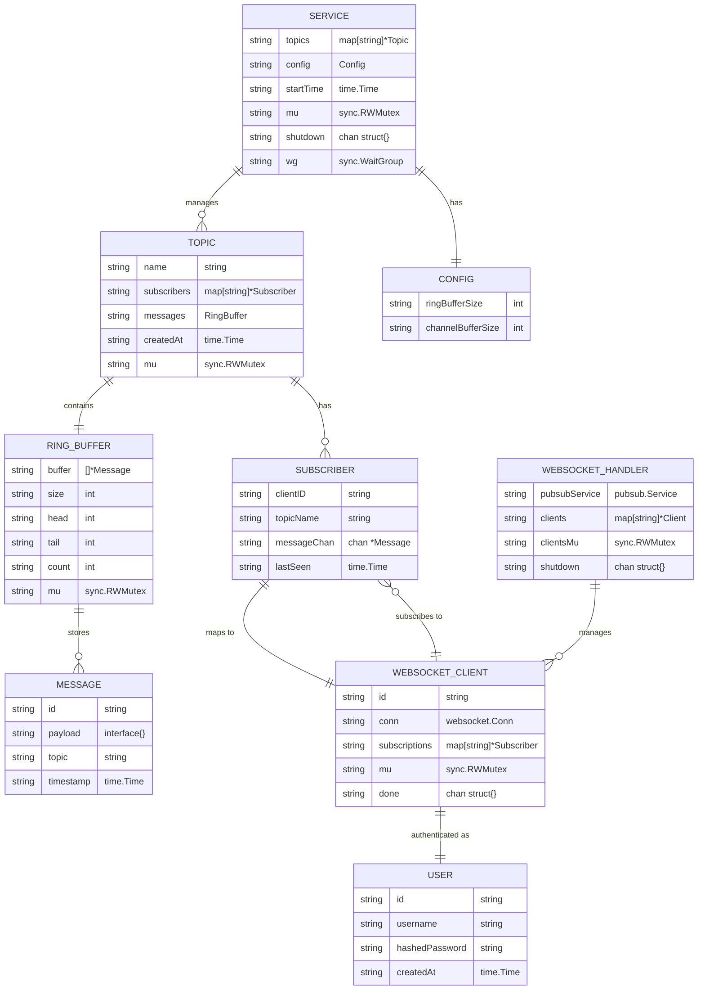

# PubSub System - Low Level Design (LLD)

## Entity Relationship Diagram

## Data Flow Diagram

## System Architecture Overview

## Message Flow Sequence

## Component Interaction Map

## Key Relationships Summary

| Relationship | Type | Description |
|--------------|------|-------------|
| SERVICE → TOPIC | 1:N | Service manages multiple topics |
| TOPIC → RING_BUFFER | 1:1 | Each topic has one message history buffer |
| TOPIC → SUBSCRIBER | 1:N | Each topic can have multiple subscribers |
| RING_BUFFER → MESSAGE | 1:N | Ring buffer stores multiple messages |
| SUBSCRIBER → WEBSOCKET_CLIENT | 1:1 | Each subscriber maps to one WebSocket client |
| WEBSOCKET_CLIENT → SUBSCRIBER | 1:N | Each client can subscribe to multiple topics |
| WEBSOCKET_HANDLER → WEBSOCKET_CLIENT | 1:N | Handler manages multiple clients |
| SERVICE → CONFIG | 1:1 | Service has one configuration |
| WEBSOCKET_CLIENT → USER | 1:1 | Each client is authenticated as one user |

## Thread Safety & Concurrency

---
